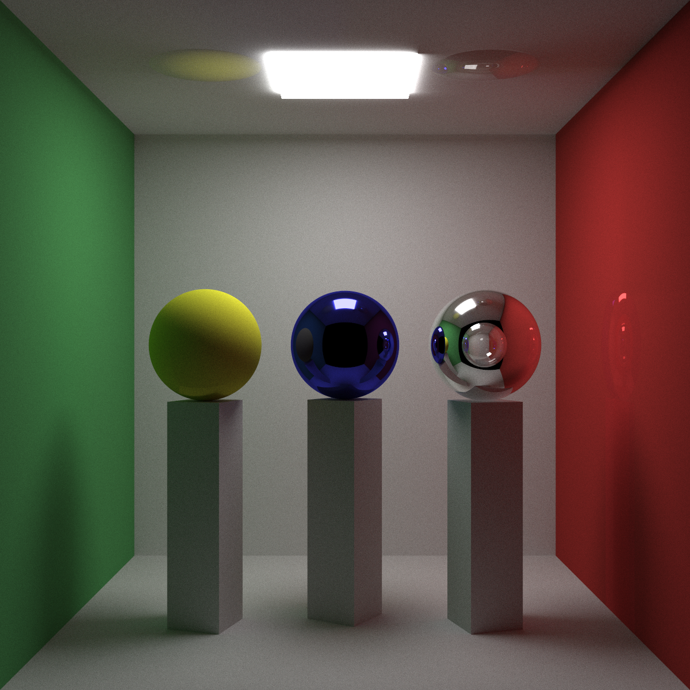
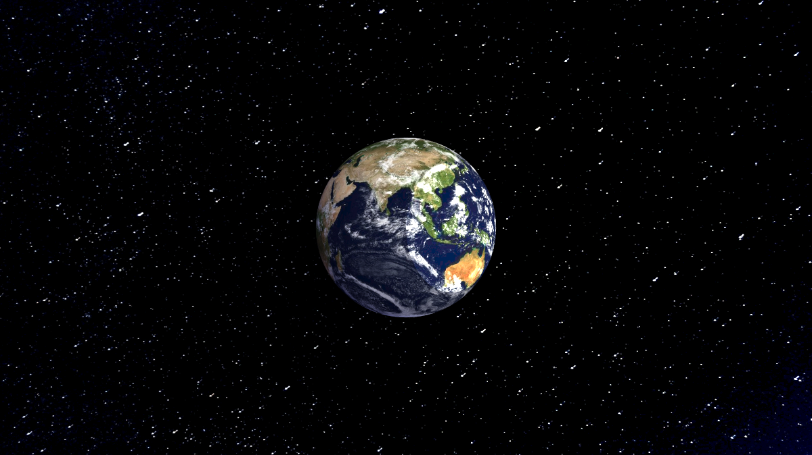
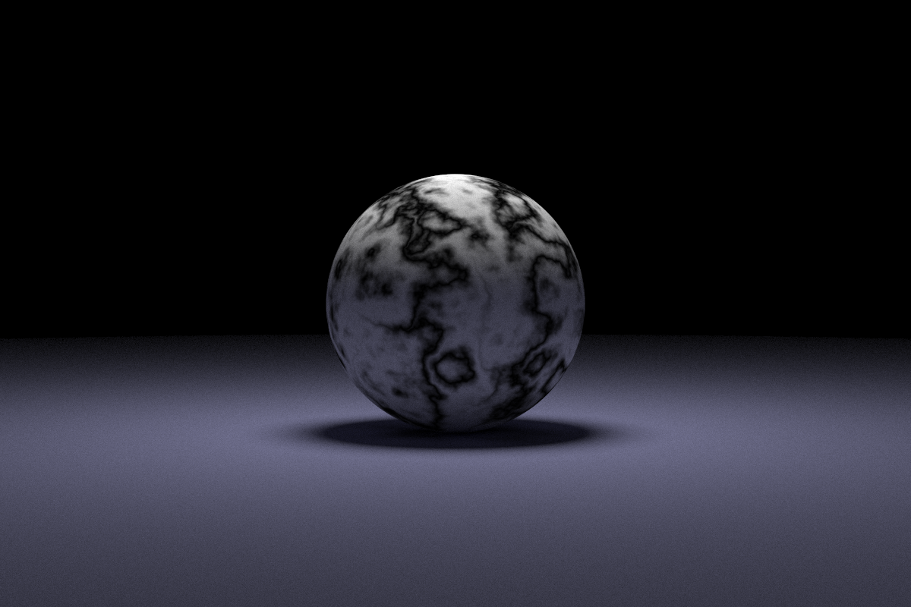

# Raymond

Raymond is a simple raytracer written in C++.

## Features

- **JSON-based scenes**: Generate images by defining a scene in a JSON file.
- **Basic Geometry**: Generate scenes with Spheres, Boxes, and Quads.
- **Multiple Materials**: Apply materials like Lambertian, Metal, Dielectric, and DiffuseLight.
- **Anti-aliasing**: Smoothes jagged edges on curves and diagonal lines.
- **Depth control**: Control how many times the ray bounces.
- **Parallelized using OpenMP**: Rendering of the image is parallelized over multiple threads.
- **Multiple output formats supported**: Supports jpg, png, and ppm image formats.

## Images generated by raymond


Scene file for this: [./example_scenes/cornell_box/cornell_box_scene.json](./example_scenes/cornell_box/cornell_box_scene.json)


Scene file for this: [./example_scenes/earth/earth_scene.json](./example_scenes/earth/earth_scene.json)


Scene file for this: [./example_scenes/perlin/perlin_output.png](./example_scenes/perlin/perlin_scene.json)

## Usage

- Clone the repo
```bash
git clone https://github.com/nishantHolla/raymond
cd raymond
```

- Build the project
```bash
make release
cd out
```

- Run raymond
```bash
./raymond input_scene.json output_image.png
```

## Creating a scene file

1. Create a new `input_scene.json` file.
2. Add a `camera` section to define the properties of the camera in the scene.
```json
{
  "camera": {
    "aspect_ratio": 1.77778,
    "image_width": 1200,
    "samples_per_pixel": 300,
    "max_depth": 500,
    "background": [0.1, 0.1, 0.3],
    "vfov": 60,
    "lookfrom": [0, 0, -9],
    "lookat": [0, 0, 0],
    "vup": [0, 1, 0],
    "defocus_angle": 0
  },
}
```
- `aspect_ratio`: Ratio of the width of the output image to the height
- `image_width`: Width of the output image in pixels
- `samples_per_pixel`: Number of samples to take for each pixel (Higher the number, slower the render)
- `max_depth`: Maximum number of bounces for each ray (Higher the number, slower the render)
- `background`: [r, g, b] color value of the background of the scene
- `vfov`: "Vertical field of view" — how zoomed in or out the camera is
- `lookfrom`: [x, y, z] vector position of the camera in 3D space
- `lookat`: [x, y, z] vector position of where the camera should look at in 3D space
- `vup`: [x, y, z] vector of "up" for the camera
- `defocus_angle`: Used for depth of field blur — keep at 0 for now.

3. Define all the textures you will need for the scene and give them a unique name that can be used
later to apply the textures.
```json
{
  "textures": {
    "earth_texture": {
      "type": "ImageTexture",
      "source": "./earthmap.jpg"
    },

    "space_texture": {
      "type": "ImageTexture",
      "source": "./space.jpg"
    }
  },
}
```
    - Here, `earth_texture` and `space_texture` are unique names assigned to the textures.
    - Each texture has a `type` which can be `ImageTexture`, `SolidColor`, `NoiseTexture`, or `CheckerTexture`.
    - Look at [./example_scenes/](./example_scenes/) to know about how to setup these textures.
    - If you define an `ImageTexture` make sure that the path to the image is relative to the executable.

4. Define all the materials you will need for the scene and give them a unique name that can be used
later to apply the materials.
```json
{
  "materials": {
    "earth_material": {
      "type": "Lambertian",
      "texture": "earth_texture"
    },

    "space_material": {
      "type": "Lambertian",
      "texture": "space_texture"
    },

    "light_material": {
      "type": "DiffuseLight",
      "color": [8, 8, 7]
    }
  },
}
```
    - Here, `earth_material`, `space_material`, and `light_material` are unique names assigned to the materials.
    - Each material has a `type` which can be `Lambertian`, `Metal`, `Dielectric`, or `DiffuseLight`.
    - Look at [./example_scenes/](./example_scenes/) to know about how to setup these materials.

5. Define all the objects you want to place in the scene and give them a unique name.
```json
{
  "entities": {
    "earth": {
      "type": "Sphere",
      "center": [0, 0, 0],
      "radius": 2,
      "material": "earth_material"
    },

    "space": {
      "type": "Quad",
      "center": [0, 0, 2],
      "horizontal": [30, 0, 0],
      "vertical": [0, 15, 0],
      "material": "space_material"
    },

    "light": {
      "type": "Sphere",
      "center": [-150, 0, -180],
      "radius": 150,
      "material": "light_material"
    }
  }
}
```
    - Here, `earth`, `space`, and `light` are unique names assigned to the entities (objects).
    - Each entity has a `type` which can be `Sphere`, `Quad`, or `Box`.
    - Each entity should be assigned a `material` that must be the name of one of the materials defined
    in the materials section
    - Look at [./example_scenes/](./example_scenes/) to know about how to setup these materials.
6. You should end up with a JSON that looks like [this](./example_scenes/earth/earth_scene.json)
7. Pass this JSON as the argument to raymond and it should render the scene as you specified.

# Reference

- [raytracing in one weekend series](https://raytracing.github.io/)
- [stb](https://github.com/nothings/stb)
- [nlohmann/json](https://github.com/nlohmann/json)
